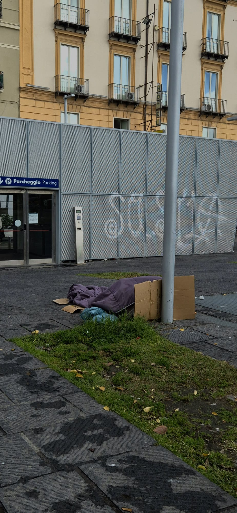
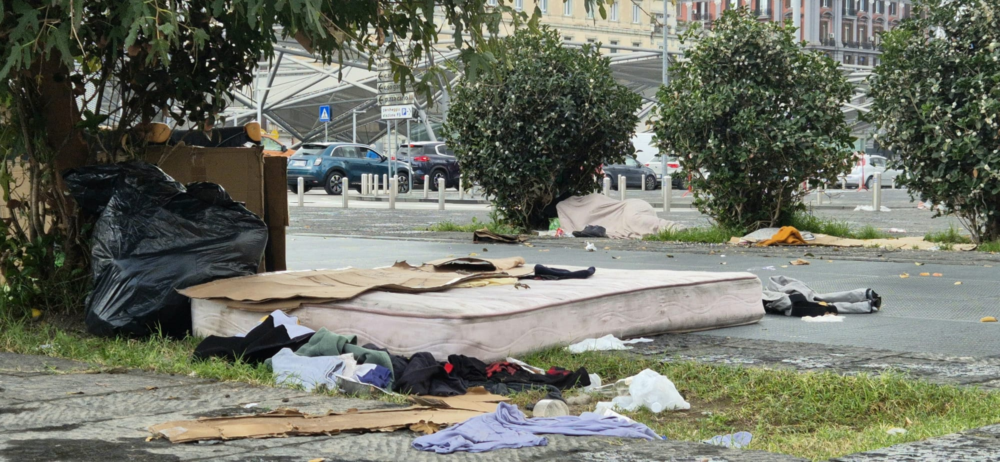
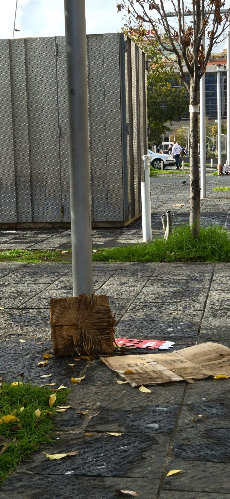
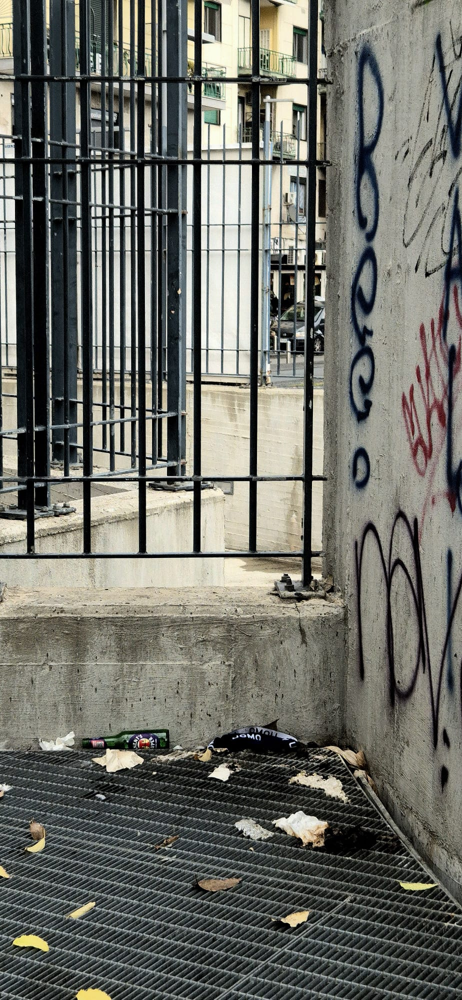
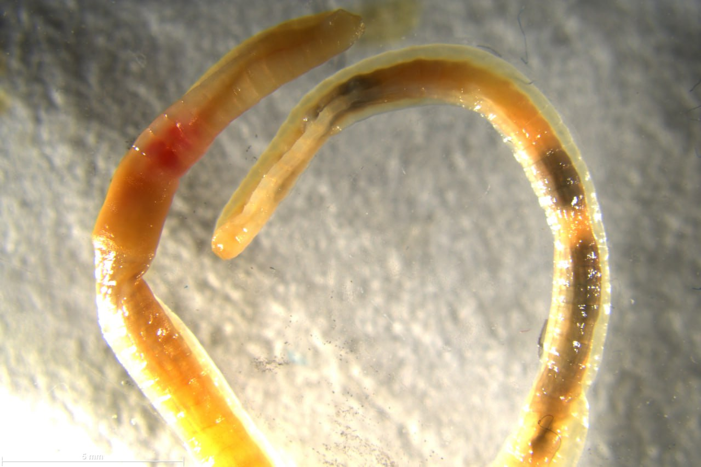
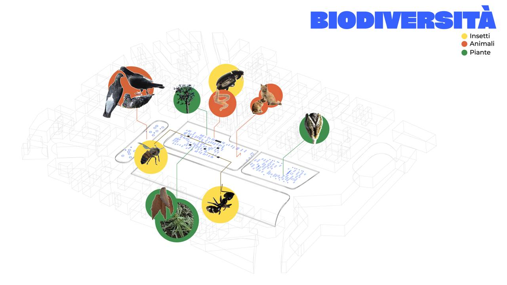

# Garibaldi
Oggi Piazza Garibaldi è uno dei punti più caotici e dinamici di Napoli, frequentato ogni giorno da migliaia di persone. La presenza della stazione Napoli Centrale, che collega la città con tantissime destinazioni, la rende fondamentale non solo per i trasporti, ma anche per la vita quotidiana della città.

Ma non è sempre stata come la vediamo ora. Un tempo, in quell’area non c’erano né piazze ampie né stazioni moderne. Solo successivamente venne costruito un grande edificio ferroviario lungo l’attuale corso Garibaldi, e intorno ad esso la piazza cominciò a prendere forma. Il suo nome originario era diverso, ma venne cambiato per ricordare uno dei protagonisti dell’Unità d’Italia.

Con il passare degli anni e l’aumento dei viaggiatori, si rese necessario spostare la stazione un po’ più indietro e ampliare l’intera zona. Fu allora che si realizzò anche un importante nodo ferroviario sotterraneo. I lavori terminarono nel 1960, dando così alla piazza l’aspetto moderno che conosciamo.

In quegli anni, l’obiettivo principale era far fronte al crescente traffico cittadino. Così, venne costruita al centro della piazza una grande pensilina sopraelevata per gli autobus, Questa struttura è rimasta per molti anni, ma alla fine è stata rimossa successivamente.

Prima ancora di tutte queste trasformazioni, Napoli era servita da due piccole stazioni ferroviarie, entrambe lungo corso Garibaldi. Solo più tardi venne costruito un edificio più grande e curato, che diede alla zona un aspetto del tutto nuovo.

Oggi, piazza Garibaldi continua a cambiare, adattandosi alle esigenze di una città in continuo movimento.

# Primo sopralluogo con foto di Piazza Garibaldi

Per iniziare a conoscere e comprendere meglio Piazza Garibaldi, abbiamo effettuato un sopralluogo il 20 novembre, accompagnati dal maestro Massimo Vicinanza. Durante l’uscita, siamo stati suddivisi in gruppi, ciascuno incaricato di approfondire un aspetto specifico della piazza e del suo contesto urbano.

Il nostro gruppo si è concentrato in particolare sui disagi sociali presenti nell’area, osservando situazioni di degrado legate alla presenza di persone senzatetto e alle tracce che spesso lasciano dopo aver trascorso la notte nella piazza.

# Esplorazione urbana – Zona Garibaldi, 5 Dicembre
Il 5 dicembre il gruppo ha svolto un’esplorazione nella zona di Garibaldi con l’obiettivo di osservare le forme di comunicazione visiva presenti nello spazio urbano, in particolare graffiti, scritte murali e altri segni informali. L’intento non era solo quello di documentare l’aspetto estetico del contesto, ma anche di cogliere i significati sociali e simbolici che queste tracce possono esprimere.
L'aspetto osservato più rilevante è quello dell'utilizzo dei graffiti come strumento di comunicazione diretta da parte di alcune attività commerciali. In più punti abbiamo trovato scritte utilizzate per indicare divieti o per attirare l’attenzione su determinati servizi. Questo tipo di segnaletica “fatta a mano” si discosta dalle modalità ufficiali, ma risulta evidente e funzionale, mostrando come il linguaggio urbano si adatti a necessità pratiche.
Durante la camminata, con gli altri miei colleghi è emersa anche una riflessione sul valore simbolico di questi interventi rispetto ad altri segni di incuria, come rifiuti o oggetti abbandonati. A differenza della sporcizia, che appare priva di intenzione, molte scritte sembrano invece esprimere un messaggio, una posizione o una presenza, anche quando si tratta di atti considerati irregolari.
Nel complesso, l’esplorazione ha evidenziato quanto la città sia attraversata da micro-narrazioni visive che raccontano vissuti, opinioni e tensioni del territorio. Questi elementi, pur spesso ignorati o rimossi, contribuiscono a delineare l’identità del luogo in modo autentico e stratificato.

# Gruppo Biodiversità
il nostro gruppo ha avuto l'opportunità di esplorare e studiare la biodiversità presente nell'area di Piazza Garibaldi. L'obiettivo principale è stato quello di analizzare i microorganismi e gli organismi più piccoli, come piante, vermi e insetti, che popolano questo spazio urbano.
Lavorando in collaborazione con gli studenti dell'Università Federico II, abbiamo utilizzato il microscopio per osservare da vicino questi organismi, scoprendo dettagli che normalmente sfuggono all'occhio nudo. 

Dopo aver studiato i microorganismi, gli insetti e le piante che abbiamo osservato a Piazza Garibaldi, abbiamo deciso di creare una ''mappa'' in cui abbiamo posizionato le immagini di ciascun organismo, indicando esattamente dove li abbiamo trovati.
In questo modo, possiamo visualizzare facilmente la distribuzione di queste specie all’interno di Piazza Garibaldi, rendendo più chiaro il rapporto tra gli organismi e i diversi punti dell’area.
